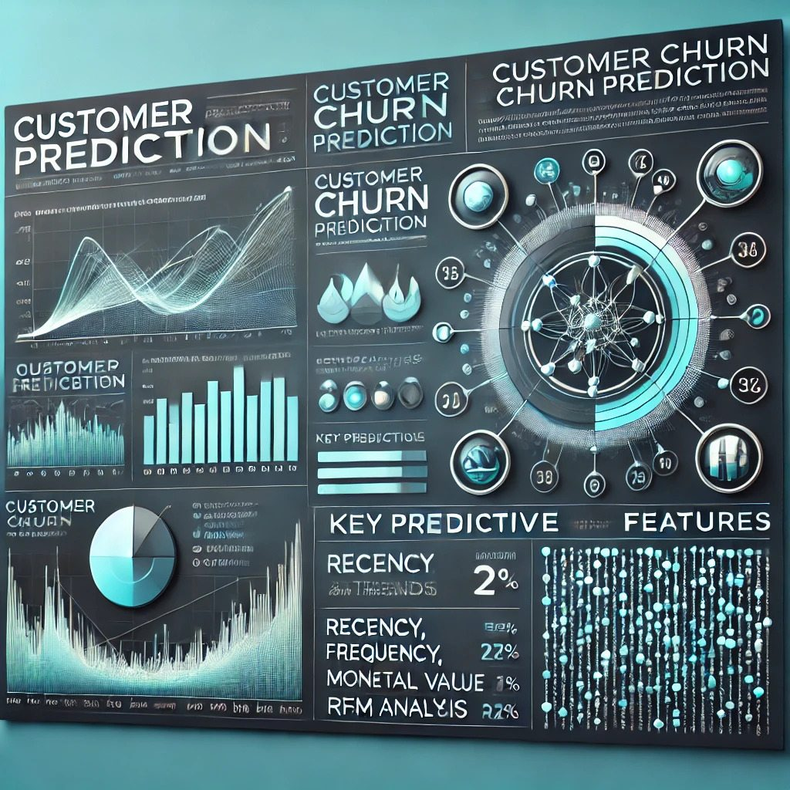

Dynamic and motivated Computer Science graduate with a strong foundation in programming, seeking a position in the software industry. Eager to apply my technical skills and knowledge gained through academic projects and internships to contribute to innovative software solutions. Committed to continuous learning and professional growth in a collaborative and dynamic environment. 

## Projects
### Google Analytics Tracking
[Project](https://github.com/Gnanu123/Churn-prediction)

This project involves analyzing transaction data of merchants using company's payment processing services. The primary objectives are to categorize different types of businesses based on transaction patterns and predict merchant churn to inform retention strategies using machine learning algorithms

### Customer Churn Prediction
[Project](https://github.com/Gnanu123/Churn-prediction)

This project involves analyzing transaction data of merchants using company's payment processing services. The primary objectives are to categorize different types of businesses based on transaction patterns and predict merchant churn to inform retention strategies using machine learning algorithms

### Smart home system
[Project](https://github.com/Gnanu123/Smart-Home-system-design)

This Smart Home System Design Project models a sophisticated automated home environment, incorporating a variety of sensors, control devices, and integrated external systems. The project involves designing a comprehensive software architecture to manage key functionalities such as temperature regulation, home security, water leak detection, fire alarms, and energy monitoring.

### Sales analysis
[Project](https://github.com/Gnanu123/Sales-performance-PowerBI)

This project involves the analysis and visualization of sales data for a Organisation using Power BI. The goal of this analysis is to evaluate the year-to-date (YTD) sales performance, compare it against the previous year's data (PYTD), and identify key metrics that impact profitability and sales growth. The insights provided help in making data-driven decisions for better sales and profitability management.

### Flight reviews analysis
[Project](https://github.com/Gnanu123/Flight-ratings---Tableau)

This project involves the analysis and visualization of customer reviews for Airways using Tableau. The primary objective of this dashboard is to provide a comprehensive overview of customer feedback across various metrics, including service quality, entertainment, seat comfort, and value for money. The insights derived from this analysis can help identify key areas of improvement and enhance the overall customer experience.

